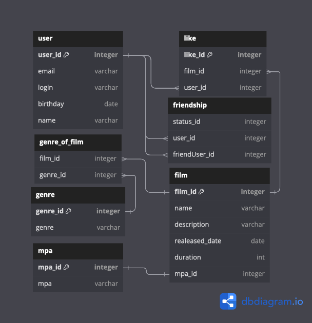

# ТЗ 11
Это ветка технического задания №11.
-
В данной задаче были реализованы классы:
1) UserService - отвечает за обработку пользователей
2) FilmService - отвечает за обработку фильмов
3) UserStorage - интерфейс для работы с пользователями
4) FilmStorage - интерфейс для работы с фильмами
5) FilmDbStorage - класс для взаимодействия фильмов с базой данных
6) UserDbStorage - класс для взаимодействия пользователей с базой данных
5) ExceptionHandler - класс для отлавливания ошибок и формироавния ответа пользователю с теле сообщения

Также были реализованы тесты для проверки контроллеров

Схема связи таблиц базы данных: 
-

